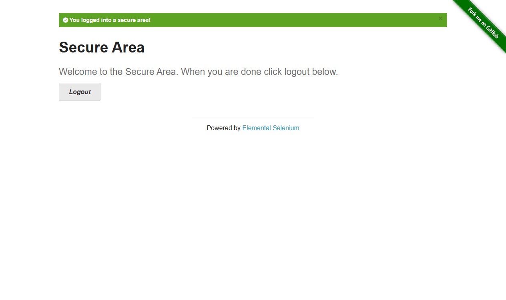

# Question 2

## Part A - Successful login

The script is in [login.test.js](login.test.js). The first test opens Chrome, enters `tomsmith` and `SuperSecretPassword!`, and clicks Login. It checks that the success message is visible and contains `You logged into a secure area!`, then saves `screenshots/login-success.png` and closes Chrome.

## Part B (i) - Failed login

The second test uses `wronguser` and `WrongPassword!`. It checks that a visible error contains `Your username is invalid!` and that the browser remains on the login page. Each test uses a new browser session, and `finally` closes it even if the test fails.

## Part B (ii) - Waits and locators

### Implicit and explicit waits

An implicit wait applies to element searches across the browser session. If an element is not found immediately, Selenium keeps looking until the timeout. It does not check whether the element is visible or ready to use.

For example, this line in `logIn()` finds the Login button:

```javascript
await driver.findElement(By.css("button[type='submit']")).click();
```

If an implicit wait were configured, the `findElement()` call would keep looking for the button until that timeout. I would use this for a simple page where an element takes a moment to appear. Our script does not configure an implicit wait, and an implicit wait would not wait for the button to become clickable.

An explicit wait is for a specific condition. Our `visibleElement()` helper waits for an element to exist and then become visible:

```javascript
const element = await driver.wait(until.elementLocated(locator), waitTime);
await driver.wait(until.elementIsVisible(element), waitTime);
```

For example, the successful login test calls this helper before reading the success message:

```javascript
const message = await visibleElement(driver, By.css('.flash.success'));
```

This is useful because the message appears after submitting the form. The wait ends as soon as the condition is met, or fails after `waitTime` (10 seconds). I used explicit waits so the fields and messages are visible before the script uses them. I would not mix implicit and explicit waits, since that can make timeout behaviour unpredictable.

### Preferred locator

I would use a unique, stable ID first. The username and password fields already have IDs, so `By.id('username')` and `By.id('password')` are easy to read and do not depend on the page layout.

For elements without an ID, I would use a short CSS selector, such as `button[type='submit']` or `.flash.error`. I would avoid a long XPath tied to the page structure because a small layout change could break it.

Reference: [Selenium waiting strategies](https://www.selenium.dev/documentation/webdriver/waits/).

## Test run

Both tests passed on 4 October 2026 using headless Chrome and selenium-webdriver 4.50.0. There were 2 passes and no failures or skipped tests.


